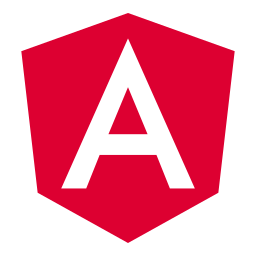
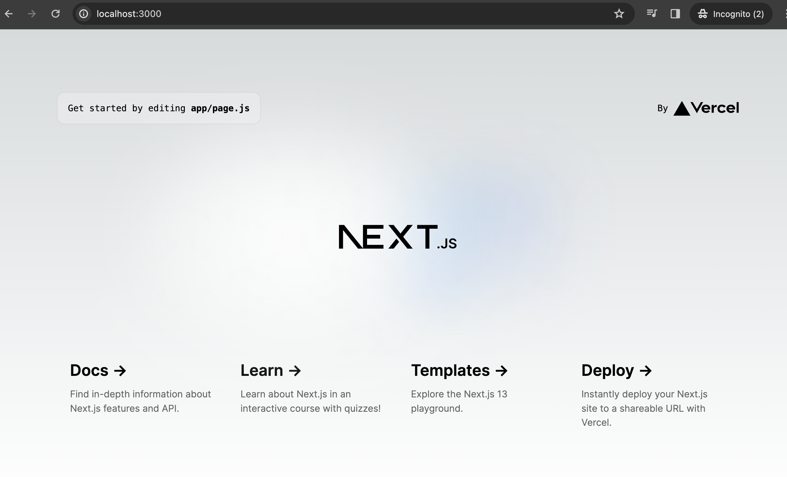
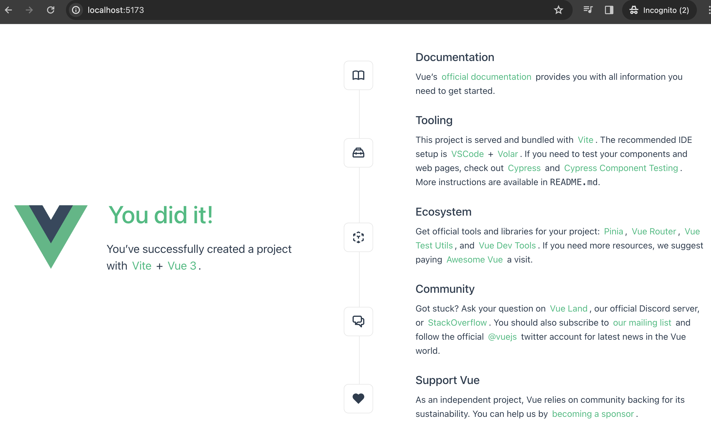
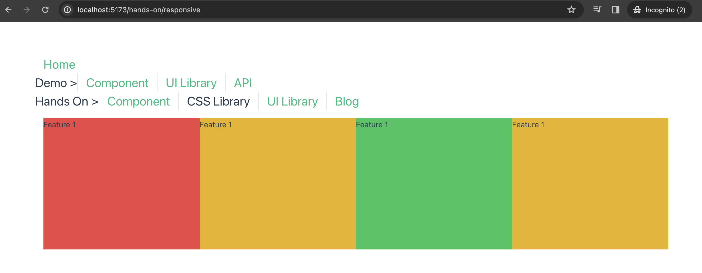
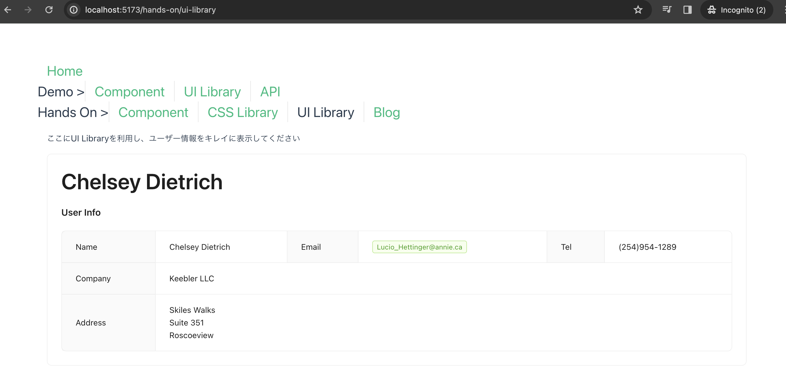
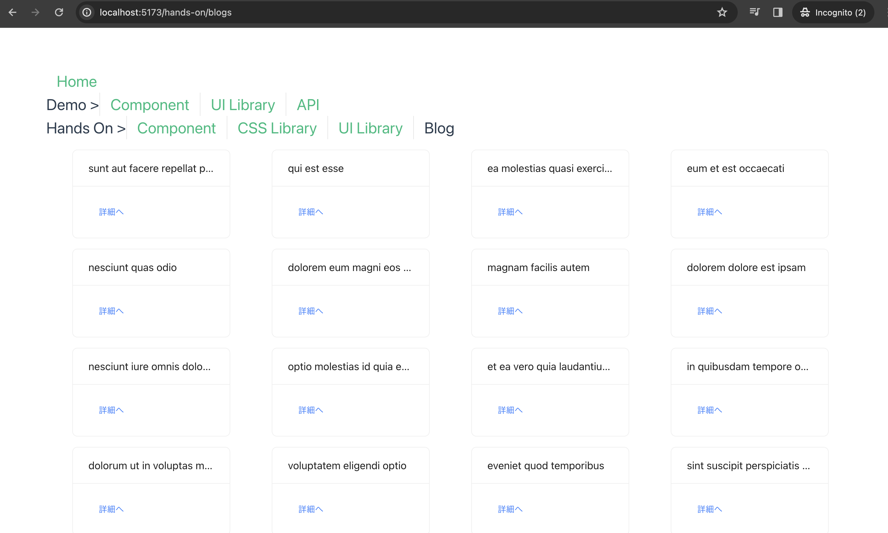
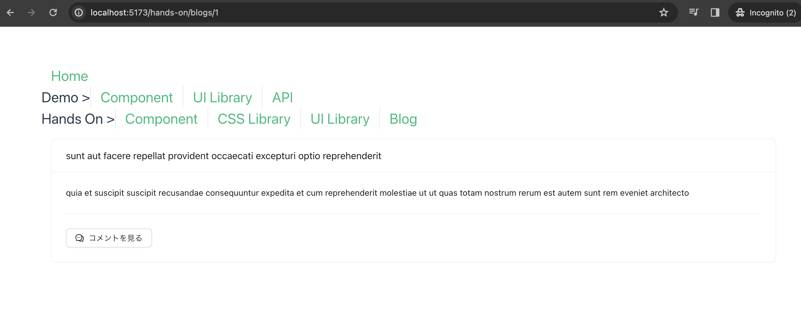
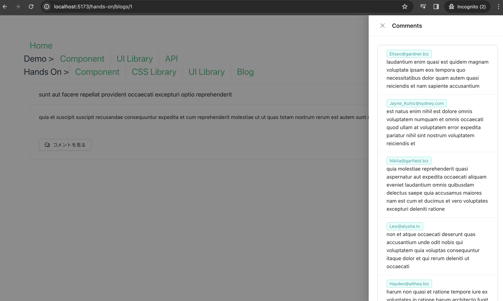

- [本講座の目的](#本講座の目的)
- [Chapter 1. モダンフロントエンド開発の概要](#chapter-1-モダンフロントエンド開発の概要)
  - [1. フロントエンド開発とは何か？](#1-フロントエンド開発とは何か)
  - [2. フロントエンドとバックエンド開発比較](#2-フロントエンドとバックエンド開発比較)
  - [3. MVCモデル](#3-mvcモデル)
  - [4. シングルページアプリケーション（SPA）の基本](#4-シングルページアプリケーションspaの基本)
  - [5. フロントエンド開発（SPA）とMVCモデルとの違い](#5-フロントエンド開発spaとmvcモデルとの違い)
  - [6. フロントエンド開発（SPA）メリットとデメリット](#6-フロントエンド開発spaメリットとデメリット)
  - [7. フロントエンドエコシステムの概要](#7-フロントエンドエコシステムの概要)
  - [8. フロントエンド技術の進化・最新の開発トレンド](#8-フロントエンド技術の進化最新の開発トレンド)
- [Chapter 2. フロントエンド開発の基礎](#chapter-2-フロントエンド開発の基礎)
  - [1. HTML、CSS、JavaScriptの役割（W3CのWeb標準）](#1-htmlcssjavascriptの役割w3cのweb標準)
    - [HTML](#html)
    - [CSS](#css)
    - [JavaScript](#javascript)
  - [2. レスポンシブデザインの基本](#2-レスポンシブデザインの基本)
  - [Hands-on 1. レスポンシブデザイン](#hands-on-1-レスポンシブデザイン)
  - [3. JavaScriptとTypescript](#3-javascriptとtypescript)
  - [4. TypeScriptの特徴](#4-typescriptの特徴)
  - [5. Node.js](#5-nodejs)
  - [6. npm (package.json)](#6-npm-packagejson)
  - [7. ビルド](#7-ビルド)
  - [8. デプロイメント](#8-デプロイメント)
  - [9. デバッグツールの活用](#9-デバッグツールの活用)
- [Chapter 3. フロントエンドフレームワーク](#chapter-3-フロントエンドフレームワーク)
  - [1. React](#1-react)
  - [2. Angular](#2-angular)
  - [3. Vue.js](#3-vuejs)
  - [4. Svelte](#4-svelte)
  - [Hands-on 2. React/Vue.js](#hands-on-2-reactvuejs)
  - [5. Vue.jsの基本](#5-vuejsの基本)
    - [Vue.jsの基本構造](#vuejsの基本構造)
    - [コンポーネントベースの開発](#コンポーネントベースの開発)
  - [Hands-on 3. Vue.jsコンポーネント作成](#hands-on-3-vuejsコンポーネント作成)
    - [Vue.jsコンポーネントの課題](#vuejsコンポーネントの課題)
  - [6. 状態管理ライブラリ](#6-状態管理ライブラリ)
  - [7. コンポーネントライブラリの活用](#7-コンポーネントライブラリの活用)
  - [Hands-on 4. CSS/UIライブラリーの使用](#hands-on-4-cssuiライブラリーの使用)
    - [課題1 Tailwind CSSによるレスポンシブ実装](#課題1-tailwind-cssによるレスポンシブ実装)
    - [課題2 UIライブラリー実装](#課題2-uiライブラリー実装)
- [Chapter 4. Vue.jsの深堀り](#chapter-4-vuejsの深堀り)
  - [1. 非同期処理](#1-非同期処理)
  - [2. REST APIとの連携](#2-rest-apiとの連携)
  - [Hands-on 5. REST APIの使用](#hands-on-5-rest-apiの使用)
  - [Hands-on 6. Blogシングルページアプリケーション実践](#hands-on-6-blogシングルページアプリケーション実践)


# 本講座の目的

1. フロントエンド開発とMVC開発の違いを理解する
2. フロントエンド開発の基本の知識（キーワード）を把握する
3. 人気のフレームワークでSPA開発を体験する


*<span style="font-size: 0.7em" >＊異なるフロントエンドの開発手法と構成が多数ありますが、講義の内容は弊社の開発実績をベースとして一般化されたものになります。</span>*


# Chapter 1. モダンフロントエンド開発の概要

## 1. フロントエンド開発とは何か？

フロントエンド :　
- ユーザーが直接操作するインターフェース部分を担当します。
- UIを実装しながら、APIと連携し、入力の送信及びデータの可視化の開発

バックエンド:　
- ユーザーからは直接見えない、裏側でデータ処理とロジックを担当します。
- データベースへのアクセス、APIの設計、セキュリティ管理 などの開発


## 2. フロントエンドとバックエンド開発比較

|  | フロントエンド | バックエンド |
| -------- | -------- | -------- |
| ユーザーが直接操作する  | O  | X  |
| データベースやサーバーなどの技術を使用する  | X  | O  |
| 使用される技術 | HTML、CSS、JavaScript | Java、Python、PHP、Ruby など |
| 主な仕事内容 | 画面や動作の開発 | データ処理や機能の実現 |

## 3. MVCモデル

- Model (モデル):
    - データとアプリケーションのビジネスロジックを管理する
    - データベースからデータを取得、更新、削除し、アプリケーションの状態を維持します。
- View (ビュー):
  - ユーザーインターフェース（UI）を構築し、データを表示します。
  - ビューはユーザーからの入力を受け取り、コントローラーに伝えます。
- Controller (コントローラー):
  - ユーザーからのリクエストを処理し、必要なモデル操作を呼び出します。
  - モデルからのデータを取得し、適切なビューに渡して表示します。

MVCアーキテクチャのWebフレームワーク *ASP .NET MVC、Ruby on Rails、PHP Laravel*

## 4. シングルページアプリケーション（SPA）の基本

- **1つのHTMLファイル**: SPAは通常、1つのHTMLファイル（index.htmlなど）を持っています。このHTMLファイルは初回のアクセス時に読み込まれ、その後のページ遷移では再度読み込む必要がありません。
- **動的なコンテンツ**: SPAはJavaScriptを使用して、ページ内のコンテンツを動的に変更します。これにより、ページ遷移がスムーズになります。
- **クライアントサイドルーティング**: SPAはクライアントサイドでルーティングを処理します。URLの変更に応じて、異なるビューを表示するためのルーティング機構が含まれています。
- **APIとの通信**: SPAは通常、バックエンドAPIと通信してデータを取得します。データの非同期取得が可能で、リアルタイム性のあるアプリケーションを開発できます。
- **クライアントサイドステート管理**: SPAでは、クライアントサイドでアプリケーションの状態（ステート）を管理する必要があります。これは通常、状態管理ライブラリ（例：Redux、Vuex）を使用して行われます。
- **SEO対策**: SPAは初期表示時にHTMLを読み込むため、検索エンジン最適化（SEO）に注意が必要です。一部のSPAフレームワークはサーバーサイドレンダリング（SSR）をサポートし、SEOを向上させるためのソリューションを提供しています。
- **パフォーマンス**: SPAは初回ロード時に大きなJavaScriptファイルをダウンロードすることがあるため、パフォーマンスに注意が必要です。コード分割やバンドリングツールを使用して最適化することが一般的です。

## 5. フロントエンド開発（SPA）とMVCモデルとの違い

*MVCのView (ビュー)に近いイメージですが* 

SPAの特徴：
- ソースコードの分離
- 外観と画面上の動作をフォーカス
- 一つのHTMLを読み取りだけ
- 非同期でクライアント側でコンテンツを更新する
- デプロイ・ホスティング方式

**MVCモデル**： 画面遷移つどサーバーにリクエストし、新しいHTMLを読み取る

**SPA**： 初回だけ、SPAサーバーからHTMLを読み取る
データ必要な時だけ、APIサーバーにリクエスト

例：[Apple開発者ガイド](https://developer.apple.com/jp/design/human-interface-guidelines)

## 6. フロントエンド開発（SPA）メリットとデメリット

**メリット**
- **ユーザーエクスペリエンスの向上**：ユーザーインタフェースと動作に焦点を当てており、UXの向上を図ることができます
- **高度なデザイン制御**：デザイン担当者に連携しやすく、カスタマイズが容易になります
- **パフォーマンス向上**：非同期かつ最小限の通信でデータ取得、ページリロードする必要なく、変更ある部分だけ反映されます
- **開発の効率化**：エンジニアの役割を分担し、ソースコードの管理とデプロイも独自で運用できます

**デメリット**
- 技術の変化が激しい
- スキルの習得コスト
- SEO（検索エンジン最適化）影響


## 7. フロントエンドエコシステムの概要

- **HTML**：マークアップ言語、コンテンツの構造の定義
- **CSS**：スタイルシート言語、見た目やデザインの制御
- **JavaScript**：動的な動作やインタラクティブな機能の実装
- **フレームワーク**：開発を効率化するためのツールセットやライブラリ　例：[React](https://ja.react.dev/), [Vue](https://ja.vuejs.org/) 等
- **状態管理**：アプリケーション全体の状態管理を簡化するライブラリ
- **バンドラ**：複数のJavaScriptおよびCSSファイルを結合し、最適化するツール　例：[Webpack](https://webpack.js.org/), [Rollup](https://rollupjs.org/)等
- **バージョン管理**：ソースコードの変更を追跡し、協力作業するためのシステム　例：Git、AWS CodeCommit等
- **テストフレームワーク**：ユニットテスト、E2Eテストなどを自動化するためのツール　例：[Jest](https://jestjs.io/ja/), [Cypress](https://www.cypress.io/)等
- **ビルドツール**：ソースコードを本番用に変換するためのツール　例：[Vite](https://ja.vitejs.dev/guide/why.html), [Babel](https://babeljs.io/)等
- **デプロイメント**：本番環境にデプロイするプロセス 例：クラウドホスティング、CDN等

## 8. フロントエンド技術の進化・最新の開発トレンド

- **コンポーネントベースの開発**:：UI要素を再利用可能なコンポーネントとして設計し、メンテナンス性を向上させる
- **TypeScriptやJSDoc**：型安全性を提供し、コードの品質を向上させる
- **仮想DOM使用しないフレームワーク**：バンドルサイズの削減とパフォーマンスの向上させる　例：[Svelte](https://svelte.jp/), [Solidjs](https://www.solidjs.com/)
- **サーバーレスアーキテクチャ**：フロントエンドとバックエンドの連携を簡素化し、スケーラビリティを向上させる
- **シングルページアプリケーション（SPA）**：1つのページで完結するし、ユーザーエクスペリエンスの向上させる
- **静的サイトジェネレーター（SSG）**：高速でSEOフレンドリーなウェブサイトを構築できる 例：[Next.js(React)](https://nextjs-ja-translation-docs.vercel.app/docs/getting-started)、[Nuxt.js(Vue)](https://nuxt.com/)
- **サーバーサイドレンダリング（SSR）**：HTMLをサーバー側でレンダリングする技術です。パフォーマンスの向上させる。


# Chapter 2. フロントエンド開発の基礎

## 1. HTML、CSS、JavaScriptの役割（W3CのWeb標準）

### HTML

**役割**
- Webページの構造を記述する言語
- テキスト、画像、リンクなどの要素を配置する
- コンテンツ（テーブル、フォームなど）に合わせてレイアウトを定義する


**注意点**
- 構造と表示を分離する
- アクセシビリティを意識する

### CSS

**役割**
- Webページの見た目を制御する言語
- 文字の色、大きさ、位置などを指定する
- 背景色、画像、フォントを指定する
- 要素の配置やレイアウトを調整する

**注意点**
- セマンティックなCSSを書く
- モバイルデバイスにも対応する

### JavaScript

**役割**
- Webページの動作を制御する言語
- ユーザーの操作に応じて、Webページの表示や機能を変更する
- アニメーションやエフェクトを作成できる(Canvas, WebGL)
- サーバーとの通信を行う

**注意点**
- パフォーマンスを意識する
- セキュリティに注意する

## 2. レスポンシブデザインの基本

レスポンシブデザインは、異なるデバイスや画面サイズに適応させるためのデザインアプローチです。

- **フレキシブルなレイアウト**
固定幅ではなく、相対的なユニットやパーセンテージを使用して要素を配置し、画面サイズに合わせて自動的に調整されるようにします。
- **メディアクエリ**
CSSのメディアクエリを使用して、特定の画面サイズやデバイス条件にスタイルを適用します。
- **コンテンツの重要性**
画面が狭い場合でも、主要なコンテンツに焦点を当てるデザインを心掛けます。
- **モバイルファースト**
通常はモバイルファーストのアプローチを採用します。モバイルのデザインを基にデスクトップデザインを拡張していきます。


## Hands-on 1. レスポンシブデザイン

**課題**
[このURL](https://codepen.io/don-wang-ml/pen/poqLPvK)を開いて，CSSを修正する

目標：
- Laptop画面：4つ横並び
- Tablet画面：2つ横並び
- SP画面：1つ横並び


## 3. JavaScriptとTypescript

JavaScriptは**動的型付け**言語であり、変数の型が実行時に決まります。


大規模なアプリケーション開発のニーズ：
- エラーの早期発見
- コードの保守性


[TypeScript](https://learn.microsoft.com/ja-jp/training/modules/typescript-get-started/)は、これらの問題を解決するために開発された(by Microsoft)プログラミング言語です。JavaScriptのすべての機能を備えながら、**静的型付け**の機能を追加しています。

Javascript:
```javascript
let name = "太郎";
let age = 30;
let isStudent = true;
let fruits = ["apple", "banana", "cherry"];
let person = { name: "Alice", age: 25 };

function add(a, b) {
  return a + b;
}
```

Typescript:
```typescript
let name: string = "太郎";
let age: number = 30;
let isStudent: boolean = true;
let fruits: string[] = ["apple", "banana", "cherry"];
let person: { name: string; age: number } = { name: "Alice", age: 25 };

function add(a: number, b: number): number {
  return a + b;
}
```

## 4. TypeScriptの特徴

- **型安全性**
静的型付け言語であり、変数の型はコード記述時に明示的に指定されます。これにより、型関連のエラーを事前に捉えることができます。

- **コンパイル**
TypeScriptコードはコンパイルが必要です。TypeScriptファイル（.ts）は、コンパイラによってJavaScriptファイル（.js）に変換されます。

- **ツールとエコシステム**
TypeScriptには型定義ファイル（.d.ts）が提供され、多くのJavaScriptライブラリとの統合が容易です。また、豊富な開発ツール（例: Visual Studio Code）やフレームワーク（例: Angular, React）とも組み合わせて使用できます。

## 5. Node.js

- **JavaScript/TypeScriptの実行環境**: 
Node.jsはJavaScriptをサーバーサイドやコマンドラインで実行するためのランタイム環境です。これにより、JavaScriptをブラウザ以外の環境で使用できます。
例：	
`$ echo "console.log('hello node')" >> app.js`
`$ node app.js`

- **拡張性**:
Node.jsはモジュールとして構築されており、さまざまなサードパーティのモジュールやライブラリを使用できます。これにより、開発者は簡単にカスタム機能を追加できます。

- **npmとの統合**: 
Node.jsはnpmを通じてパッケージ管理が可能です。この統合により、多くのオープンソースのライブラリやツールが利用可能で、依存関係の解決とパッケージのインストールが簡単に行えます。
例： 	
`$ npm install -g systeminformation ` 
`$ systeminformation`  ＊システム情報を表示するパッケージ

- **クロスプラットフォーム**:
Node.jsはさまざまなプラットフォーム（Windows、macOS、Linuxなど）で動作し、クロスプラットフォームの開発が容易です。


## 6. npm (package.json)
- **パッケージ管理**: 
npmはNode.jsのパッケージ管理ツールで、JavaScriptライブラリやモジュールのインストール、アップデートを行う

- **バージョン管理**:
異なるバージョンのパッケージをプロジェクトごとに使用できます。これにより、アプリケーションの安定性を保ちつつ新しい機能を取り入れることができます

- **依存関係の解決**:  
必要なパッケージを自動的にインストールします。これにより、開発者は手動でパッケージを追跡する手間を省くことができます。

- **スクリプト実行**:
カスタムビルドスクリプトやテストスクリプトを簡単に実行できます。

- **大規模なエコシステム**:
npmは世界中の開発者によって使用されており、数百万ものパッケージが提供されています。


## 7. ビルド
- **コードのコンパイル**: 
ソースコード（主にHTML、CSS、JavaScript）をコンパイルおよび最適化します。これには、TypeScriptやSassのコンパイル、JavaScriptのバンドリングやトランスパイルが含まれます。

- **バンドリング**:
複数のJavaScriptやCSSファイルを単一のバンドルファイルにまとめることで、HTTPリクエスト数を削減し、読み込み時間を短縮します。

- **最適化**:  
コードの最適化は、不要なスペースやコメントの削除、コードの圧縮（minification）、デッドコードの排除などを行います。これにより、ファイルサイズを削減し、パフォーマンスを向上させます。

- **リソースのバージョニング**:
プロダクションビルドでは、静的ファイルにハッシュやバージョン番号を追加して、キャッシュの制御やブラウザキャッシュの問題を回避します。


## 8. デプロイメント

- **本番環境へのファイル配置**: 
ビルドされたファイルは、本番環境のウェブサーバーやクラウドホスティングプロバイダーに配置されます。これにはFTP、SSH、CI/CDツール、デプロイスクリプトなどが使用されます。

- **コンテンツデリバリーネットワーク（CDN）の活用**:
CDNを使用して、静的ファイル（画像、スタイルシート、JavaScript）を高速かつ安定して配信します。CDNを活用することで、読み込み時間を短縮できます。

- **セキュリティ対策**:  
プロダクション環境でのセキュリティを確保するために、HTTPSの設定、セキュリティヘッダーの追加、クロスオリジンリソース共有（CORS）の設定などを行います。

- **継続的インテグレーション/継続的デリバリー（CI/CD）**:
CI/CDツールを使用して、自動化されたデプロイメントパイプラインを構築します。これにより、コードの変更が自動的に本番環境にデプロイされます。

例：クラウドホスティング [Vercel](https://vercel.com/) 

## 9. デバッグツールの活用

- Chrome DevTools: 
ブラウザのデベロッパーツールは、フロントエンド開発者にとって最も一般的で強力なデバッグツールの一つです。
＊通常、F12キーまたは右クリックメニューから開くことができます。
  - **デバッグコンソール**：実行時デバッグ
  - **エラーのスタックトレース**：エラー原因追跡
  - **ネットワーク**：通信・APIの監視とテスト
  - **ユーザーエージェント切り替え**：レスポンシブ・地理情報などのテスト
  - **ソースマップ**：圧縮されたコードを元のソースコードにマッピングする
  - **パフォーマンスインサイト**：ページのパフォーマンス測定
  - その他

- 外部ツール
  - [React Developer Tools](https://chrome.google.com/webstore/detail/react-developer-tools/fmkadmapgofadopljbjfkapdkoienihi)：Reactアプリのデバッグツール
  - [Vue.js devtools](https://chrome.google.com/webstore/detail/vuejs-devtools/nhdogjmejiglipccpnnnanhbledajbpd/)：Vue.jsアプリのデバッグツール
  - [Wappalyzer](https://chrome.google.com/webstore/detail/wappalyzer-technology-pro/gppongmhjkpfnbhagpmjfkannfbllamg)：ページで使われる技術を検出
  - [axe DevTools](https://chrome.google.com/webstore/detail/axe-devtools-web-accessib/lhdoppojpmngadmnindnejefpokejbdd)：アクセシビリティスキャン


# Chapter 3. フロントエンドフレームワーク

## 1. React


**Facebook**が開発した[React](https://ja.react.dev/)は、コンポーネントベースのライブラリで、**大規模な**シングルページアプリケーション（SPA）の開発に広く使用されています。仮想DOMを使用してパフォーマンスを最適化し、**コミュニティ**と**エコシステム**が非常に活発です。

Componentコード例：

```javascript
import React from 'react';

class HelloWorld extends React.Component {
  render() {
    const { name } = this.props; 
    return <h1>Hello, {name}!</h1>;
  }
}

export default HelloWorld;
```


## 2. Angular



**Google**が開発した[Angular](https://angular.jp/)は、堅牢なフレームワークで、**複雑**なアプリケーションの開発に適しており、テストやドキュメント作成などの**機能が充実**しています。型安全性を重視しています（TypeScript）。

Componentコード例：
```typescript
import { Component, Input } from '@angular/core';

@Component({
  selector: 'app-hello-world',
  template: '<h1>Hello, {{ name }}!</h1>',
　})
export class HelloWorldComponent {
  @Input() name: string;
}

```

## 3. Vue.js


[Vue.js](https://ja.vuejs.org/)は、Angularの元開発者により開発されました。
**シンプル**で**学習しやすい**フレームワークで、**小規模から中規模**のプロジェクトに適しています。コンポーネントベースのアーキテクチャとリアクティブなデータバインディングを特徴としています。

Componentコード例：
```html
<template>
  <h1>Hello, {{ name }}!</h1>
</template>

<script setup>
import { ref, defineProps } from 'vue';

const { name } = defineProps(['name']);
</script>
```

## 4. Svelte


[Svelte](https://svelte.jp/)は、コンパイル型のフレームワークで、仮装DOMとランタイムライブラリが必要ないため、ファイルサイズが**小さく高速**です。**プレーンなJavaScript**を使用し、コンポーネント指向の開発をサポートします。

Componentコード例：
```html
<script>
  export let name;
</script>

<h1>Hello, {name}!</h1>
```


## Hands-on 2. React/Vue.js

**課題**：
- React/Vue.jsのアプリを立ち上げる
- 例のcomponentを実装する

*＊事前にnode環境の設定が必要です。推奨 node18~*
*＊デモのためオプションは全部noでOK*

**Reactのセットアップ**

```shell
$ npx create-next-app
$ cd ‘上に入力した名前’
$ npm run dev
```


**Vue.jsのセットアップ**

```shell
$ npm create vue@latest
$ cd ‘上に入力した名前’
$ npm install
$ npm run dev
```



## 5. Vue.jsの基本

### Vue.jsの基本構造

**Sample Component**

```html
<template>
  <h1>Hello, {{ name }}!</h1>
  <p>{{ message }}</p>
  <button @click="reverseMessage">Reverse</button>
</template>

<script setup>
import { ref, defineProps } from "vue";

const { name } = defineProps(["name"]);
const message = ref("This is component demo!");
const reverseMessage = () => {
  message.value = message.value.split("").reverse().join("");
};
</script>

<style scoped>
h1 { font-size: 18px; }
</style>
```

- **.vue** 拡張子のファイルに記述されます。
- **`<template>`** セクション内にコンポーネントのHTMLを記述します。
- **`<script setup>`** ブロック内でコンポーネントのデータとメソッドを定義します。
- **`<style scoped>`**ブロックはコンポーネントのCSSを定義します。
- **data**: アプリケーションの状態を表現します。`const` キーワードを使用して変数を宣言し、ref を使用してリアクティブなデータを作成します。
- **props**: 親コンポーネントから受け取りプロパティを定義します。`defineProps name`を使用してそれをテンプレート内で使用しています。
- **directive**: `<template>`内でデータを表示するために、ディレクティブが使用されます。例えば、`{{ message }}` はデータ `message` の値を表示します。他にも、`v-for`、`v-if`、`v-bind`などのディレクティブがあります。
- **method**: イベント処理やデータの操作に使用されます。ボタンがクリックされたときに `reverseMessage` `メソッドが呼び出され、message` データが反転されます。


### コンポーネントベースの開発

コンポーネントベースの開発は、アプリケーションを独立した部品やコンポーネントに分割し、それぞれのコンポーネントを構築、テスト、および保守する方法です。

- **コンポーネント**：
再利用可能な部品で、特定の機能やUI要素を表し、単一の役割を果たします。
- **プロパティとイベント**:
コンポーネント間のコミュニケーションは、親から子にプロパティを渡し、子からイベントを発行して親に情報を伝えます。
- **メリット**：
  - 開発効率の向上
  - 保守性の向上
  - テストのしやすさ

**コンポーネントの利用**:コンポーネントを他のコンポーネント内で利用できます。

```html
<script setup>
import BasicDemo from "../../components/BasicDemo.vue";
</script>

<template>
  <BasicDemo name="Vue" />
</template>
```

## Hands-on 3. Vue.jsコンポーネント作成

**事前準備**

[Hands On Vue Demo](https://github.com/monstar-lab-oss/frontend-development-tutorial-vue-handson.git)`main` branchから課題用ソースコードをコピー
- VSCodeでフォルダを開く
- VSCodeでTerminal/PowerShellを開く
```shell
$ cd vue-demo
$ npm install
$ npm run dev
```

＊課題の解答は[Hands On Vue Demo](https://github.com/monstar-lab-oss/frontend-development-tutorial-vue-handson.git)　各`feature/xxxx` branchをご参考ください。 `develop` branchは全部の解答が反映した内容になります。

### Vue.jsコンポーネントの課題

- Demo >Componentを参照し
- Counterのコンポーネントを作成する
- 数字を表示する
- ボタン押すとプラス1
- Hands On >Componentにて表示される
  
実装結果例：


## 6. 状態管理ライブラリ

**状態管理**とは、状態を中央で管理し、アプリケーション内のコンポーネント間でデータを共有する方法です。

[Pinia](https://pinia.vuejs.org/)はVue 3向けの状態管理ライブラリで、より簡単に管理することができます。

例：Counterの状態をアプリ全体に共有する
```javascript
export const useCounterStore = defineStore("counter", () => {
  const count = ref(0);
  const doubleCount = computed(() => count.value * 2);
  function increment() {
    count.value++;
  }

  return { count, doubleCount, increment };
});
```

## 7. コンポーネントライブラリの活用

公開のUI・機能コンポーネントを利用することで、開発時間を短縮することができます。


- Vue 3全般的なリソースリスト：
  https://github.com/vuesomedev/awesome-vue-3
- CSSライブラリー
  - [Tailwind CSS](https://tailwindcss.com/)：ユーティリティファーストなCSSフレームワークです。CSSの各プロパティに対応するクラスを用意し、それらを組み合わせることでスタイリングを行う方法です。
- UIライブラリー
  - [Vuetify](https://vuetifyjs.com/en/)：マテリアルデザインの原則に従っています。コンポーネントのカスタマイズが容易であり、アプリケーションの外観を整えるのに役立ちます。
  - [Ant Design Vue](https://antdv.com/components/overview)：幅広いコンポーネントとテーマを提供し、多言語対応、アクセシビリティ、カスタマイズ性などがあります。大規模なプロジェクトに適しています。

## Hands-on 4. CSS/UIライブラリーの使用

### 課題1 Tailwind CSSによるレスポンシブ実装


- src/views/hands-on/Responsive.vue
- Hands On >Responsive画面をレスポンシブに変更
- Tailwindの方法でCSSを修正

- 目標：
  - Laptop画面：4つ横並び
  - Tablet画面：2つ横並び
  - SP画面：1つ横並び

参考：Tailwind CSSのレスポンシブについて
https://tailwindcss.com/docs/responsive-design

実装結果例：



### 課題2 UIライブラリー実装

- src/views/hands-on/UI.vue
- Hands On >UI Library画面にユーザー情報を表示
- ユーザーデータは`<script setup>`に定義済み
- And Design Vueのコンポーネントを利用して、キレイなUIを作る

参考：And Designのコンポーネント
https://antdv.com/components/overview

実装結果例：



# Chapter 4. Vue.jsの深堀り

## 1. 非同期処理

JavaScriptは**シングルスレッド**のプログラミング言語であるため、一度に一つのタスクしか実行できません。

非同期処理の利用で
- 処理の並列化：複数処理の実行時間を短縮する
- ユーザーエクスペリエンスの向上：ユーザーが操作を実行した直後に処理結果を表示する

非同期処理の種類
- Micro Task Queue
  - Promiseオブジェクトなど
  - 優先度高い
- Macro Task Queue
  - setTimeout(), setInterval()など
  - 優先度低い

例：　下記コードをDevToolsのconsoleで実行して、結果を確認しましょう
```javascript
console.log("start");

setTimeout(() => {
  console.log("setTimeout");
}, 0);

Promise.resolve("promise").then(res => console.log(res));

console.log("end");
```

## 2. REST APIとの連携

REST API基本的な仕組み
- **リソースの識別**：URI（Uniform Resource Identifier）リソースの場所や属性を示す文字列
- **メソッド**：HTTPメソッドを使用して操作を表現します。GETはリソースの読み取り、POSTはリソースの作成、PUTはリソースの更新、DELETEはリソースの削除を表します。
- **データ**：JSON（JavaScript Object Notation）などのテキスト形式を使用してデータを表現します。

GETの例 
```shell
$ curl https://jsonplaceholder.typicode.com/user/1
```

フロントエンドでのREST API接続
- fetch() 関数
- Axios ライブラリ

Fetchの例
```html
<script setup>
const data = await fetch('/api/users').then((response) => response.json());
</script>
```

Axiosの例
```html
<script setup>
import { Axios } from 'axios';
const { data } = await Axios.get('/api/users');
</script>
```

- `.then` メソッドは、非同期処理が正常に完了した場合に呼び出されます
- `.catch` メソッドは、非同期処理が失敗した場合に呼び出されます。


## Hands-on 5. REST APIの使用

**課題**
- src/views/hands-on/UI.vue
- Hands On >UI Library画面のユーザー情報をAPIから取得し、画面に表示する

API URL：
https://jsonplaceholder.typicode.com/users/5

＊user idは1 - 10まで指定できます

## Hands-on 6. Blogシングルページアプリケーション実践

**課題**
- src/views/hands-on/BlogList.vue
- Hands On >Blog 画面に記事一覧を作成
  - タイトルと詳細へボタン
- UIライブラリーを利用し、キレイに並ぶ
- 詳細へボタンを押下したら記事詳細画面へ遷移
- 記事詳細画面で記事の内容を表示

- ボーナスチャレンジ：
  - 詳細画面でボタン押したら記事のコメントを表示する

コメントAPI URL：
https://jsonplaceholder.typicode.com/posts/${id}/comments


実装結果例：

Blog一覧


Blog詳細


Blogコメント

