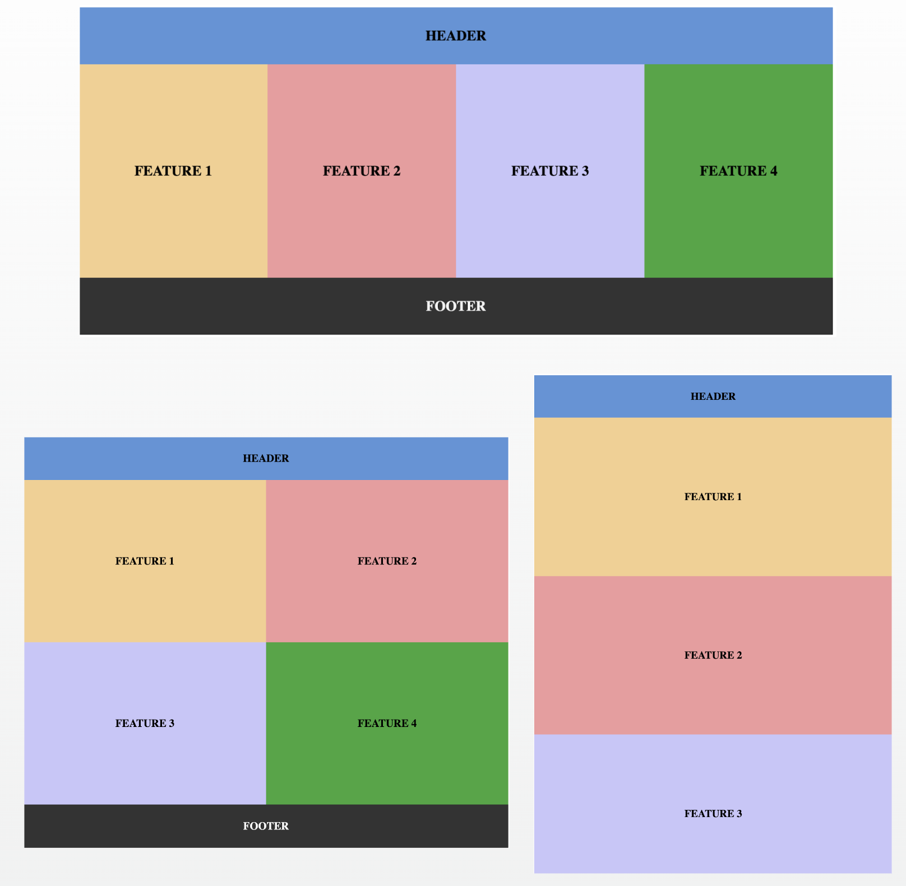

- [本講座の目的](#本講座の目的)
- [Chapter 1 モダンフロントエンド開発の概要](#chapter-1-モダンフロントエンド開発の概要)
  - [フロントエンド開発とは何か？](#フロントエンド開発とは何か)
  - [フロントエンドとバックエンド開発比較](#フロントエンドとバックエンド開発比較)
  - [MVCモデル](#mvcモデル)
  - [シングルページアプリケーション（SPA）の基本](#シングルページアプリケーションspaの基本)
  - [フロントエンド開発（SPA）とMVCモデルとの違い](#フロントエンド開発spaとmvcモデルとの違い)
  - [フロントエンド開発（SPA）メリットとデメリット](#フロントエンド開発spaメリットとデメリット)
  - [フロントエンドエコシステムの概要](#フロントエンドエコシステムの概要)
  - [フロントエンド技術の進化・最新の開発トレンド](#フロントエンド技術の進化最新の開発トレンド)
- [Chapter 2 フロントエンド開発の基礎](#chapter-2-フロントエンド開発の基礎)
  - [HTML、CSS、JavaScriptの役割（W3CのWeb標準）](#htmlcssjavascriptの役割w3cのweb標準)
    - [HTML](#html)
    - [CSS](#css)
    - [JavaScript](#javascript)
  - [レスポンシブデザインの基本](#レスポンシブデザインの基本)
  - [ハンズオン- レスポンシブデザイン](#ハンズオン--レスポンシブデザイン)
  - [JavaScriptとTypescript](#javascriptとtypescript)
  - [TypeScriptの特徴](#typescriptの特徴)
  - [Node.js](#nodejs)
  - [npm (package.json)](#npm-packagejson)
  - [ビルド](#ビルド)
  - [デプロイメント](#デプロイメント)
  - [デバッグツールの活用](#デバッグツールの活用)
- [Chapter 3 フロントエンドフレームワーク](#chapter-3-フロントエンドフレームワーク)


# 本講座の目的

1. フロントエンド開発とMVC開発の違いを理解する
2. フロントエンド開発の基本の知識（キーワード）を把握する
3. 人気のフレームワークでSPA開発を体験する


*<span style="font-size: 0.7em" >＊異なるフロントエンドの開発手法と構成が多数ありますが、講義の内容は弊社の開発実績をベースとして一般化されたものになります。</span>*


# Chapter 1 モダンフロントエンド開発の概要

## フロントエンド開発とは何か？

フロントエンド :　
- ユーザーが直接操作するインターフェース部分を担当します。
- UIを実装しながら、APIと連携し、入力の送信及びデータの可視化の開発

バックエンド:　
- ユーザーからは直接見えない、裏側でデータ処理とロジックを担当します。
- データベースへのアクセス、APIの設計、セキュリティ管理 などの開発


## フロントエンドとバックエンド開発比較

|  | フロントエンド | バックエンド |
| -------- | -------- | -------- |
| ユーザーが直接操作する  | O  | X  |
| データベースやサーバーなどの技術を使用する  | X  | O  |
| 使用される技術 | HTML、CSS、JavaScript | Java、Python、PHP、Ruby など |
| 主な仕事内容 | 画面や動作の開発 | データ処理や機能の実現 |

## MVCモデル

- Model (モデル):
    - データとアプリケーションのビジネスロジックを管理する
    - データベースからデータを取得、更新、削除し、アプリケーションの状態を維持します。
- View (ビュー):
  - ユーザーインターフェース（UI）を構築し、データを表示します。
  - ビューはユーザーからの入力を受け取り、コントローラーに伝えます。
- Controller (コントローラー):
  - ユーザーからのリクエストを処理し、必要なモデル操作を呼び出します。
  - モデルからのデータを取得し、適切なビューに渡して表示します。

MVCアーキテクチャのWebフレームワーク *ASP .NET MVC、Ruby on Rails、PHP Laravel*

## シングルページアプリケーション（SPA）の基本

- **1つのHTMLファイル**: SPAは通常、1つのHTMLファイル（index.htmlなど）を持っています。このHTMLファイルは初回のアクセス時に読み込まれ、その後のページ遷移では再度読み込む必要がありません。
- **動的なコンテンツ**: SPAはJavaScriptを使用して、ページ内のコンテンツを動的に変更します。これにより、ページ遷移がスムーズになります。
- **クライアントサイドルーティング**: SPAはクライアントサイドでルーティングを処理します。URLの変更に応じて、異なるビューを表示するためのルーティング機構が含まれています。
- **APIとの通信**: SPAは通常、バックエンドAPIと通信してデータを取得します。データの非同期取得が可能で、リアルタイム性のあるアプリケーションを開発できます。
- **クライアントサイドステート管理**: SPAでは、クライアントサイドでアプリケーションの状態（ステート）を管理する必要があります。これは通常、状態管理ライブラリ（例：Redux、Vuex）を使用して行われます。
- **SEO対策**: SPAは初期表示時にHTMLを読み込むため、検索エンジン最適化（SEO）に注意が必要です。一部のSPAフレームワークはサーバーサイドレンダリング（SSR）をサポートし、SEOを向上させるためのソリューションを提供しています。
- **パフォーマンス**: SPAは初回ロード時に大きなJavaScriptファイルをダウンロードすることがあるため、パフォーマンスに注意が必要です。コード分割やバンドリングツールを使用して最適化することが一般的です。

## フロントエンド開発（SPA）とMVCモデルとの違い

*MVCのView (ビュー)に近いイメージですが* 

SPAの特徴：
- ソースコードの分離
- 外観と画面上の動作をフォーカス
- 一つのHTMLを読み取りだけ
- 非同期でクライアント側でコンテンツを更新する
- デプロイ・ホスティング方式

**MVCモデル**： 画面遷移つどサーバーにリクエストし、新しいHTMLを読み取る

**SPA**： 初回だけ、SPAサーバーからHTMLを読み取る
データ必要な時だけ、APIサーバーにリクエスト

例：[Apple開発者ガイド](https://developer.apple.com/jp/design/human-interface-guidelines)

## フロントエンド開発（SPA）メリットとデメリット

**メリット**
- **ユーザーエクスペリエンスの向上**：ユーザーインタフェースと動作に焦点を当てており、UXの向上を図ることができます
- **高度なデザイン制御**：デザイン担当者に連携しやすく、カスタマイズが容易になります
- **パフォーマンス向上**：非同期かつ最小限の通信でデータ取得、ページリロードする必要なく、変更ある部分だけ反映されます
- **開発の効率化**：エンジニアの役割を分担し、ソースコードの管理とデプロイも独自で運用できます

**デメリット**
- 技術の変化が激しい
- スキルの習得コスト
- SEO（検索エンジン最適化）影響


## フロントエンドエコシステムの概要

- **HTML**：マークアップ言語、コンテンツの構造の定義
- **CSS**：スタイルシート言語、見た目やデザインの制御
- **JavaScript**：動的な動作やインタラクティブな機能の実装
- **フレームワーク**：開発を効率化するためのツールセットやライブラリ　例：[React](https://ja.react.dev/), [Vue](https://ja.vuejs.org/) 等
- **状態管理**：アプリケーション全体の状態管理を簡化するライブラリ
- **バンドラ**：複数のJavaScriptおよびCSSファイルを結合し、最適化するツール　例：[Webpack](https://webpack.js.org/), [Rollup](https://rollupjs.org/)等
- **バージョン管理**：ソースコードの変更を追跡し、協力作業するためのシステム　例：Git、AWS CodeCommit等
- **テストフレームワーク**：ユニットテスト、E2Eテストなどを自動化するためのツール　例：[Jest](https://jestjs.io/ja/), [Cypress](https://www.cypress.io/)等
- **ビルドツール**：ソースコードを本番用に変換するためのツール　例：[Vite](https://ja.vitejs.dev/guide/why.html), [Babel](https://babeljs.io/)等
- **デプロイメント**：本番環境にデプロイするプロセス 例：クラウドホスティング、CDN等

## フロントエンド技術の進化・最新の開発トレンド

- **コンポーネントベースの開発**:：UI要素を再利用可能なコンポーネントとして設計し、メンテナンス性を向上させる
- **TypeScriptやJSDoc**：型安全性を提供し、コードの品質を向上させる
- **仮想DOM使用しないフレームワーク**：バンドルサイズの削減とパフォーマンスの向上させる　例：[Svelte](https://svelte.jp/), [Solidjs](https://www.solidjs.com/)
- **サーバーレスアーキテクチャ**：フロントエンドとバックエンドの連携を簡素化し、スケーラビリティを向上させる
- **シングルページアプリケーション（SPA）**：1つのページで完結するし、ユーザーエクスペリエンスの向上させる
- **静的サイトジェネレーター（SSG）**：高速でSEOフレンドリーなウェブサイトを構築できる 例：[Next.js(React)](https://nextjs-ja-translation-docs.vercel.app/docs/getting-started)、[Nuxt.js(Vue)](https://nuxt.com/)
- **サーバーサイドレンダリング（SSR）**：HTMLをサーバー側でレンダリングする技術です。パフォーマンスの向上させる。


# Chapter 2 フロントエンド開発の基礎

## HTML、CSS、JavaScriptの役割（W3CのWeb標準）

### HTML

**役割**
- Webページの構造を記述する言語
- テキスト、画像、リンクなどの要素を配置する
- コンテンツ（テーブル、フォームなど）に合わせてレイアウトを定義する


**注意点**
- 構造と表示を分離する
- アクセシビリティを意識する

### CSS

**役割**
- Webページの見た目を制御する言語
- 文字の色、大きさ、位置などを指定する
- 背景色、画像、フォントを指定する
- 要素の配置やレイアウトを調整する

**注意点**
- セマンティックなCSSを書く
- モバイルデバイスにも対応する

### JavaScript

**役割**
- Webページの動作を制御する言語
- ユーザーの操作に応じて、Webページの表示や機能を変更する
- アニメーションやエフェクトを作成できる(Canvas, WebGL)
- サーバーとの通信を行う

**注意点**
- パフォーマンスを意識する
- セキュリティに注意する

## レスポンシブデザインの基本

レスポンシブデザインは、異なるデバイスや画面サイズに適応させるためのデザインアプローチです。

- **フレキシブルなレイアウト**
固定幅ではなく、相対的なユニットやパーセンテージを使用して要素を配置し、画面サイズに合わせて自動的に調整されるようにします。
- **メディアクエリ**
CSSのメディアクエリを使用して、特定の画面サイズやデバイス条件にスタイルを適用します。
- **コンテンツの重要性**
画面が狭い場合でも、主要なコンテンツに焦点を当てるデザインを心掛けます。
- **モバイルファースト**
通常はモバイルファーストのアプローチを採用します。モバイルのデザインを基にデスクトップデザインを拡張していきます。


## ハンズオン- レスポンシブデザイン

**課題**
[このURL](https://codepen.io/don-wang-ml/pen/poqLPvK)を開いて，CSSを修正する

目標：
- Laptop画面：4つ横並び
- Tablet画面：2つ横並び
- SP画面：1つ横並び




## JavaScriptとTypescript

JavaScriptは**動的型付け**言語であり、変数の型が実行時に決まります。


大規模なアプリケーション開発のニーズ：
- エラーの早期発見
- コードの保守性


[TypeScript](https://learn.microsoft.com/ja-jp/training/modules/typescript-get-started/)は、これらの問題を解決するために開発された(by Microsoft)プログラミング言語です。JavaScriptのすべての機能を備えながら、**静的型付け**の機能を追加しています。

Javascript:
```javascript
let name = "太郎";
let age = 30;
let isStudent = true;
let fruits = ["apple", "banana", "cherry"];
let person = { name: "Alice", age: 25 };

function add(a, b) {
  return a + b;
}
```

Typescript:
```typescript
let name: string = "太郎";
let age: number = 30;
let isStudent: boolean = true;
let fruits: string[] = ["apple", "banana", "cherry"];
let person: { name: string; age: number } = { name: "Alice", age: 25 };

function add(a: number, b: number): number {
  return a + b;
}
```

## TypeScriptの特徴

- **型安全性**
静的型付け言語であり、変数の型はコード記述時に明示的に指定されます。これにより、型関連のエラーを事前に捉えることができます。

- **コンパイル**
TypeScriptコードはコンパイルが必要です。TypeScriptファイル（.ts）は、コンパイラによってJavaScriptファイル（.js）に変換されます。

- **ツールとエコシステム**
TypeScriptには型定義ファイル（.d.ts）が提供され、多くのJavaScriptライブラリとの統合が容易です。また、豊富な開発ツール（例: Visual Studio Code）やフレームワーク（例: Angular, React）とも組み合わせて使用できます。

## Node.js

- **JavaScript/TypeScriptの実行環境**: 
Node.jsはJavaScriptをサーバーサイドやコマンドラインで実行するためのランタイム環境です。これにより、JavaScriptをブラウザ以外の環境で使用できます。
例：	
`$ echo "console.log('hello node')" >> app.js`
`$ node app.js`

- **拡張性**:
Node.jsはモジュールとして構築されており、さまざまなサードパーティのモジュールやライブラリを使用できます。これにより、開発者は簡単にカスタム機能を追加できます。

- **npmとの統合**: 
Node.jsはnpmを通じてパッケージ管理が可能です。この統合により、多くのオープンソースのライブラリやツールが利用可能で、依存関係の解決とパッケージのインストールが簡単に行えます。
例： 	
`$ npm install -g systeminformation ` 
`$ systeminformation`  ＊システム情報を表示するパッケージ

- **クロスプラットフォーム**:
Node.jsはさまざまなプラットフォーム（Windows、macOS、Linuxなど）で動作し、クロスプラットフォームの開発が容易です。


## npm (package.json)
- **パッケージ管理**: 
npmはNode.jsのパッケージ管理ツールで、JavaScriptライブラリやモジュールのインストール、アップデートを行う

- **バージョン管理**:
異なるバージョンのパッケージをプロジェクトごとに使用できます。これにより、アプリケーションの安定性を保ちつつ新しい機能を取り入れることができます

- **依存関係の解決**:  
必要なパッケージを自動的にインストールします。これにより、開発者は手動でパッケージを追跡する手間を省くことができます。

- **スクリプト実行**:
カスタムビルドスクリプトやテストスクリプトを簡単に実行できます。

- **大規模なエコシステム**:
npmは世界中の開発者によって使用されており、数百万ものパッケージが提供されています。


## ビルド
- **コードのコンパイル**: 
ソースコード（主にHTML、CSS、JavaScript）をコンパイルおよび最適化します。これには、TypeScriptやSassのコンパイル、JavaScriptのバンドリングやトランスパイルが含まれます。

- **バンドリング**:
複数のJavaScriptやCSSファイルを単一のバンドルファイルにまとめることで、HTTPリクエスト数を削減し、読み込み時間を短縮します。

- **最適化**:  
コードの最適化は、不要なスペースやコメントの削除、コードの圧縮（minification）、デッドコードの排除などを行います。これにより、ファイルサイズを削減し、パフォーマンスを向上させます。

- **リソースのバージョニング**:
プロダクションビルドでは、静的ファイルにハッシュやバージョン番号を追加して、キャッシュの制御やブラウザキャッシュの問題を回避します。


## デプロイメント

- **本番環境へのファイル配置**: 
ビルドされたファイルは、本番環境のウェブサーバーやクラウドホスティングプロバイダーに配置されます。これにはFTP、SSH、CI/CDツール、デプロイスクリプトなどが使用されます。

- **コンテンツデリバリーネットワーク（CDN）の活用**:
CDNを使用して、静的ファイル（画像、スタイルシート、JavaScript）を高速かつ安定して配信します。CDNを活用することで、読み込み時間を短縮できます。

- **セキュリティ対策**:  
プロダクション環境でのセキュリティを確保するために、HTTPSの設定、セキュリティヘッダーの追加、クロスオリジンリソース共有（CORS）の設定などを行います。

- **継続的インテグレーション/継続的デリバリー（CI/CD）**:
CI/CDツールを使用して、自動化されたデプロイメントパイプラインを構築します。これにより、コードの変更が自動的に本番環境にデプロイされます。

例：クラウドホスティング [Vercel](https://vercel.com/) 

## デバッグツールの活用

- Chrome DevTools: 
ブラウザのデベロッパーツールは、フロントエンド開発者にとって最も一般的で強力なデバッグツールの一つです。
＊通常、F12キーまたは右クリックメニューから開くことができます。
  - **デバッグコンソール**：実行時デバッグ
  - **エラーのスタックトレース**：エラー原因追跡
  - **ネットワーク**：通信・APIの監視とテスト
  - **ユーザーエージェント切り替え**：レスポンシブ・地理情報などのテスト
  - **ソースマップ**：圧縮されたコードを元のソースコードにマッピングする
  - **パフォーマンスインサイト**：ページのパフォーマンス測定
  - その他

- 外部ツール
  - [React Developer Tools](https://chrome.google.com/webstore/detail/react-developer-tools/fmkadmapgofadopljbjfkapdkoienihi)：Reactアプリのデバッグツール
  - [Vue.js devtools](https://chrome.google.com/webstore/detail/vuejs-devtools/nhdogjmejiglipccpnnnanhbledajbpd/)：Vue.jsアプリのデバッグツール
  - [Wappalyzer](https://chrome.google.com/webstore/detail/wappalyzer-technology-pro/gppongmhjkpfnbhagpmjfkannfbllamg)：ページで使われる技術を検出
  - [axe DevTools](https://chrome.google.com/webstore/detail/axe-devtools-web-accessib/lhdoppojpmngadmnindnejefpokejbdd)：アクセシビリティスキャン


# Chapter 3 フロントエンドフレームワーク